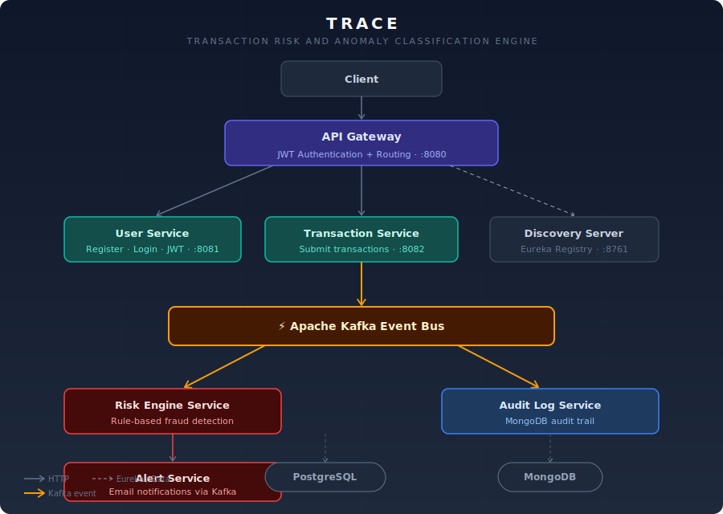

# ⚡ TRACE (Transaction Risk and Anomaly Classification Engine) — Real-Time Fraud Detection Platform

> Real-time financial transaction risk scoring system built with Java Spring Boot microservices, Kafka event streaming, JWT authentication, and a rule-based fraud detection engine.


---

## Architecture



A transaction submitted by a client travels through the API Gateway (JWT-authenticated), gets processed by the Transaction Service, and is published onto the **Kafka event bus**. Two downstream consumers act independently:

- **Risk Engine Service** — applies rule-based fraud detection and emits alerts for suspicious activity
- **Audit Log Service** — persists every event to MongoDB for a full immutable audit trail

High-risk transactions trigger the **Alert Service**, which sends email notifications in real time.

---

## What is TRACE?

**TRACE** stands for *Transaction Risk and Anomaly Classification Engine*. 

It is an enterprise-grade financial transaction risk auditing and fraud detection system structured around a high-performance event-driven microservices architecture. It evaluates incoming transaction streams in real time using decoupled processors linked via an Apache Kafka pipeline. It classifies events by risk grades and dispatches system notifications instantly when security thresholds are breached.

The system utilizes PostgreSQL for transactional data consistency, MongoDB for high-throughput append-only audit tracking, and Eureka for service registration.

---

## ✨ Features

- 🔑 **Stateless API Gateway Routing** — Custom gateway filters routing queries through security layers using JWT Bearer authentication.
- 🌐 **Real-Time Event Streaming** — Processes distributed event topics asynchronously using Apache Kafka partitions.
- 🧠 **Rule-Based Risk Scoring** — Custom risk validation assessing geo-velocity limits, transaction threshold metrics, and frequency anomalies.
- 🗄️ **Dual Database Storage** — PostgreSQL preserves user profiles and billing catalogs, while MongoDB captures raw event logs.
- 👤 **Dynamic Discovery Server** — Automatic registration and monitoring of service cluster nodes using Netflix Eureka.
- 🚨 **Instant Alerts Engine** — Alert consumers matching fraud flags and dispatching real-time email alerts.
- 🐳 **Full Containerization** — Complete Docker Compose environment containerizing Kafka, PostgreSQL, MongoDB, and all Java microservices.

---

## 🛠️ Tech Stack

### Microservices Infrastructure

| Technology | Purpose |
|---|---|
| Java 17 | Core programming language |
| Spring Boot 3.4.5 | Core framework for all services |
| Spring Cloud Gateway | API Gateway for JWT authentication and request routing |
| Netflix Eureka Server | Service discovery and routing registry |
| Spring Security + JWT | Access token authentication |
| Apache Kafka | Event broker streaming transaction payloads |
| PostgreSQL | Transaction state database |
| MongoDB | Non-relational collection storing audit trails |
| Lombok | Boilerplate getter/setter reduction |
| Docker + Docker Compose | System virtualization |

---

## 🚀 Getting Started (Local Setup)

### Prerequisites

- Java 17+
- Docker + Docker Compose
- Mail Server Settings (Optional for SMTP mail delivery)

---

### 1. Clone the repository

```bash
git clone https://github.com/ritik-hedau18/TRACE-Transaction-Risk-and-Anomaly-Classification-Engine.git
cd TRACE-Transaction-Risk-and-Anomaly-Classification-Engine
```

### 2. Start infrastructure

```bash
docker-compose up -d
```

Starts PostgreSQL on `:5432`, MongoDB on `:27017`, and Apache Kafka on `:9092`.

### 3. Service startup order

Run each service in sequence from your IDE or command line:

```
1. discovery-server    → http://localhost:8761
2. api-gateway         → http://localhost:8080
3. user-service        → http://localhost:8081
4. transaction-service → http://localhost:8082
5. risk-engine-service
6. alert-service
7. audit-log-service
```

---

## 🔌 API Reference

### User Authentication

| Method | Endpoint | Description | Auth Required |
|---|---|---|---|
| POST | `/api/auth/register` | Register a new system user | ❌ |
| POST | `/api/auth/login` | Login user, returns JWT token | ❌ |

### Transaction Management

| Method | Endpoint | Description | Auth Required |
|---|---|---|---|
| POST | `/api/transactions` | Submit transaction for processing | ✅ |
| GET | `/api/transactions` | Fetch user transaction history | ✅ |

### Fraud Audit Logs

| Method | Endpoint | Description | Auth Required |
|---|---|---|---|
| GET | `/api/audit/logs` | Query Mongo transaction audit history | ✅ |

---

## 🔒 Security

- Sensitive password strings secured using **BCrypt** hashing.
- Request routing filtered via stateless Bearer token validation at the gateway level.
- Decoupled database accounts partitioning transaction tables from alert rules.
- Sensitive credentials loaded via system environment properties.

---

## 🗄️ Database Tables

| Table / Collection | Engine | Purpose |
|---|---|---|
| `users` | PostgreSQL | Store verified system client accounts |
| `transactions` | PostgreSQL | Save processing transactions states |
| `audit_logs` | MongoDB | Append-only document database capturing JSON Kafka event states |

---

## 👤 Author

**Ritik Hedau**
Java Full Stack Developer | Spring Boot | Apache Kafka | React
📍 India

[](https://github.com/ritik-hedau18)

---

## 📄 License

This project is licensed under the [MIT License](LICENSE).
